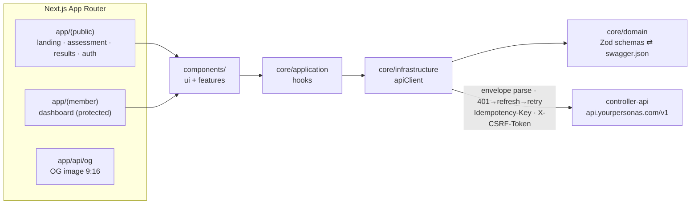
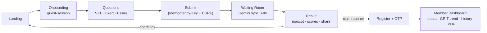

# Your Persona's — Front-End

The web interface of **Your Persona's** — a Next.js app serving a casual AI-powered personality assessment (MBTI-style + GRIT) built for Gen Z/Alpha shareability: mobile-first, dual-locale (EN + ID), with a 9:16 share-card pipeline targeting a 30% share rate.

---

## Technical Architecture

This app follows **Clean Architecture** adapted to Next.js App Router:

* **Domain** (`core/domain`): Zod schemas + TS types — written from `controller-api/docs/swagger.json` (never guessed from Go code). Dual duty: form validation AND API response parsing.
* **Application** (`core/application`): Hooks encapsulating server-state workflows (`useAuth`, `useSubmitAssessment`, `usePdfStatus`, `useQuota`).
* **Infrastructure** (`core/infrastructure`): A single `apiClient` — envelope parsing, 401→refresh→retry interceptor, `Idempotency-Key` injection, `X-CSRF-Token` header.
* **Presentation** (`app/`, `components/`): Route groups `(public)` vs `(member)`; dumb `ui/` vs smart `features/` components. Components **never `fetch` directly**.



---

## Directory Structure

```
your_persona_ui/
├── app/
│   ├── (public)/            # landing, /assessment, /results/[id], /auth/*
│   ├── (member)/dashboard/  # protected area (quota, history, GRIT trend)
│   ├── api/og/              # OG image 9:16 (@vercel/og)
│   ├── robots.ts            # allow AI crawlers; disallow /results, /dashboard, /auth
│   ├── sitemap.ts           # marketing pages only
│   └── middleware.ts        # route protection + locale negotiation
├── core/
│   ├── domain/              # Zod schemas + TS types (mirror BE DTOs)
│   ├── infrastructure/      # apiClient
│   └── application/         # hooks
├── components/
│   ├── ui/                  # dumb: Button, Input, Card
│   └── features/            # smart: AssessmentForm, MascotDisplay, WellbeingNotice
├── public/
│   ├── mascots/             # 32 assets — {MBTI}_{style}
│   └── llms.txt             # site summary for AI answer engines
├── i18n/                    # next-intl dictionaries (en.json, id.json)
└── next.config.mjs          # output: 'standalone'
```

---

## Setup & Running Locally

### Prerequisites
* Bun (runtime + package manager + test runner)
* A running `controller-api` (sibling repo) for end-to-end flows

### Step 1 — Environment Settings
Set the FE environment variables (secrets must **never** use the `NEXT_PUBLIC_` prefix — that prefix is public by definition):
* `NEXT_PUBLIC_API_BASE_URL` — controller-api base URL
* `NEXT_PUBLIC_TURNSTILE_SITE_KEY` — use Cloudflare's test sitekey (`1x00000000000000000000AA`) in dev
* `NEXT_PUBLIC_POSTHOG_KEY` — analytics (required from day 1)

### Step 2 — Install & Run
```bash
bun install
bun dev
```

### Step 3 — Build Verification
```bash
bun run build    # production build (standalone output)
bun run lint
bun test
```

---

## Core User Flow & Features



### 1. Assessment Engine
* Answers persist to localStorage via Zustand (`persist`) — refresh mid-essay loses nothing.
* Submit generates one `Idempotency-Key` per payload snapshot: retries reuse the key (no double Gemini burn), changed answers get a new key.

### 2. Token Management
* `access_token` lives **in-memory only** (Zustand) — never localStorage. `refresh_token` persists in localStorage (documented trade-off; rotation + revocation handled by BE).
* apiClient interceptor: 401 → refresh → replay the exact request — polling flows resume seamlessly mid-cycle.

### 3. Grand Reveal & Sharing
* Result page renders Teaser vs Full mode from `is_owner` (blur is FE rendering — the API returns full data to any link holder by design).
* 32 mascot assets (`{MBTI}_{style}`) with a persisted Style A/B switcher; OG image 9:16 generated at `app/api/og`; wellbeing panel rendered alongside results when `wellbeing_flag=true`.

### 4. PDF Polling
* Exponential backoff (2s→4s→8s, cap 10s) using TanStack Query's `dataUpdateCount`, hard 90s deadline, `failed` status stops immediately.

---

## Deployment

* **Bun runtime** in production (`oven/bun:alpine`, `bun server.js`), `output: 'standalone'` — Docker image target <150MB.
* NGINX reverse proxy in front; co-located with controller-api + Postgres + Redis on a 4GB VPS.
* Cloudflare CDN caches static assets (mascots, JS bundles).

```bash
docker build -f Dockerfile .
```

---

## Design System

Palette (PRD Section 3b): **primary** `#0E9AA8` (teal blue) · **secondary** `#14B8A6` (teal green) · **accent** `#9333EA` (bright purple — sparingly: CTA/badge/highlight) · dominant white background. Naive Design/kidcore aesthetic, `rounded-2xl/3xl`, soft shadows, Framer Motion micro-animations. **WCAG AA contrast is a hard requirement** — the purple accent fails easily on small text.

---

## Commands Quick Reference

| Command | Description |
|---|---|
| `bun dev` | Development server. |
| `bun run build` | Production build (standalone). |
| `bun run lint` | Linting. |
| `bun test` | Test runner. |
| `docker build -f Dockerfile .` | Standalone image build. |

---

## Documentation & Related Repos

* **`TECHNICAL_DOCUMENTATION.md`** — API contract, token management, error mapping (primary implementation reference)
* **`AGENTS.md`** — architecture & security rules · **`CHECKLIST.md`** — work order M0–M6
* **`controller-api`** (sibling repo) — backend; `docs/swagger.json` is the authoritative DTO source
* **`psyche-assessment-docs`** (sibling, local-only) — PRD, ERD, MEMORY.md
