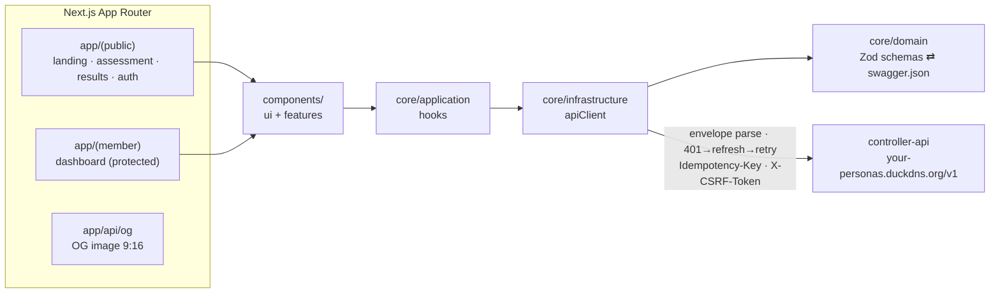
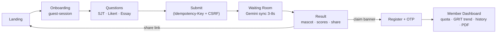

# Your Persona's — Front-End

The web interface of **Your Persona's** — a Next.js app serving a casual AI-powered personality assessment (MBTI-style + GRIT) built for Gen Z/Alpha shareability: mobile-first, dual-locale (EN + ID), with a 9:16 share-card pipeline targeting a 30% share rate.

---

## Technical Architecture

This app follows **Clean Architecture** adapted to Next.js App Router:

* **Domain** (`core/domain`): Zod schemas + TS types — written from `controller-api/docs/swagger.json` (never guessed from Go code). Dual duty: form validation AND API response parsing.
* **Application** (`core/application`): Hooks encapsulating server-state workflows (`useAuth`, `useSubmitAssessment`, `usePdfStatus`, `useQuota`).
* **Infrastructure** (`core/infrastructure`): A single `apiClient` — envelope parsing, 401→refresh→retry interceptor, `Idempotency-Key` injection, `X-CSRF-Token` header.
* **Presentation** (`app/`, `components/`): Route groups `(public)` vs `(member)`; dumb `ui/` vs smart `features/` components. Components **never `fetch` directly**.


```mermaid
flowchart LR
    subgraph App["Next.js App Router"]
        PUB["app/(public)<br/>landing · assessment · results · auth"]
        MEM["app/(member)<br/>dashboard (protected)"]
        OG["app/api/og<br/>OG image 9:16"]
    end

    PUB & MEM --> C[components/<br/>ui + features]
    C --> H["core/application<br/>hooks"]
    H --> AC["core/infrastructure<br/>apiClient"]
    AC --> D["core/domain<br/>Zod schemas ⇄ swagger.json"]
    AC -->|"envelope parse · 401→refresh→retry<br/>Idempotency-Key · X-CSRF-Token"| BE["controller-api<br/>your-personas.duckdns.org/v1"]
```

---

## Directory Structure

```
your_persona_ui/
├── app/
│   ├── (public)/            # landing, /assessment, /results/[id], /auth/*
│   ├── (member)/dashboard/  # protected area (quota, history, GRIT trend)
│   ├── api/og/              # OG image 9:16 (@vercel/og)
│   ├── robots.ts            # allow AI crawlers; disallow /results, /dashboard, /auth
│   ├── sitemap.ts           # marketing pages only
│   └── middleware.ts        # route protection + locale negotiation
├── core/
│   ├── domain/              # Zod schemas + TS types (mirror BE DTOs)
│   ├── infrastructure/      # apiClient
│   └── application/         # hooks
├── components/
│   ├── ui/                  # dumb: Button, Input, Card
│   └── features/            # smart: AssessmentForm, MascotDisplay, WellbeingNotice
├── public/
│   ├── mascots/             # 32 assets — {MBTI}_{style}
│   └── llms.txt             # site summary for AI answer engines
├── i18n/                    # next-intl dictionaries (en.json, id.json)
└── next.config.mjs          # output: 'standalone'
```

---

## Setup & Running Locally

### Prerequisites
* Bun (runtime + package manager + test runner)
* A running `controller-api` (sibling repo) for end-to-end flows

### Step 1 — Environment Settings
Set the FE environment variables (secrets must **never** use the `NEXT_PUBLIC_` prefix — that prefix is public by definition):
* `NEXT_PUBLIC_API_BASE_URL` — same-origin proxy path, leave as `/api/be` (FE-03: keeps cookies first-party regardless of domain topology; `next.config.mjs` rewrites it to `API_INTERNAL_URL`)
* `API_INTERNAL_URL` — server-only, where the Next.js server actually reaches `controller-api` (e.g. `http://localhost:8080` in dev)
* `NEXT_PUBLIC_TURNSTILE_SITE_KEY` — use Cloudflare's test sitekey (`1x00000000000000000000AA`) in dev
* `NEXT_PUBLIC_POSTHOG_KEY` — analytics (required from day 1)

### Step 2 — Install & Run
```bash
bun install
bun dev
```

### Step 3 — Build Verification
```bash
bun run build    # production build (standalone output)
bun run lint
bun test
```

---

## Core User Flow & Features


```mermaid
flowchart LR
    L[Landing] --> O["Onboarding<br/>guest-session"] --> Q[Questions<br/>SJT · Likert · Essay] --> S["Submit<br/>(Idempotency-Key + CSRF)"]
    S --> W["Waiting Room<br/>Gemini sync 3-8s"] --> R["Result<br/>mascot · scores · share"]
    R -->|share link| L
    R -->|claim banner| REG[Register + OTP] --> DB["Member Dashboard<br/>quota · GRIT trend · history · PDF"]
```

### 1. Assessment Engine
* Answers persist to localStorage via Zustand (`persist`) — refresh mid-essay loses nothing.
* Submit generates one `Idempotency-Key` per payload snapshot: retries reuse the key (no double Gemini burn), changed answers get a new key.

### 2. Token Management
* `access_token` lives **in-memory only** (Zustand) — never localStorage. `refresh_token` persists in localStorage (documented trade-off; rotation + revocation handled by BE).
* apiClient interceptor: 401 → refresh → replay the exact request — polling flows resume seamlessly mid-cycle.

### 3. Grand Reveal & Sharing
* Result page renders Teaser vs Full mode from `is_owner` (blur is FE rendering — the API returns full data to any link holder by design).
* 32 mascot assets (`{MBTI}_{style}`) with a persisted Style A/B switcher; OG image 9:16 generated at `app/api/og`; wellbeing panel rendered alongside results when `wellbeing_flag=true`.

### 4. PDF Polling
* Exponential backoff (2s→4s→8s, cap 10s) using TanStack Query's `dataUpdateCount`, hard 90s deadline, `failed` status stops immediately.

---

## Deployment & CI/CD

* **Bun runtime** in production (`oven/bun:alpine`, `bun server.js`), `output: 'standalone'` — Docker image target <150MB.
* Reverse proxy: the **shared Caddy** instance from the `controller-api` stack (one Caddy binds :80/:443 for all domains; the FE containers join the external `your-persona-shared` Docker network — see `docker/docker-compose.prod.yml` / `docker-compose.staging.yml`). Co-located with controller-api + Postgres + Redis on a 4GB VPS.
* **API proxy (FE-03):** the browser never calls `controller-api` directly — `next.config.mjs` rewrites `/api/be/*` to `API_INTERNAL_URL` (a server-only, runtime env var set per docker-compose file, not baked into the image). This keeps `session_id`/`csrf_token` cookies first-party even though FE and BE are on different DuckDNS names (two flat subdomains count as different sites for `SameSite=Strict`) — same mechanism in dev, staging, and production, so staging behaves the same as local instead of needing `SameSite=None` or a paid shared domain.
* Cloudflare CDN caches static assets (mascots, JS bundles).

### Branches & pipeline (`.github/workflows/ci.yml`)

Two long-lived branches, both protected (PR + required checks):

| Branch | On push | Deploy |
|---|---|---|
| `develop` | checks → image build+push (staging Turnstile/PostHog build-args) | **auto-deploy staging** |
| `main` | checks → image build+push (production Turnstile/PostHog build-args) | **production, gated by approval** (GitHub environment `production`) |

Checks: `secrets` (gitleaks) → `lint` / `typecheck` → `test` / `build` → `docker` (`linux/arm64` image built natively on a `ubuntu-24.04-arm` runner, pushed to GHCR as `ghcr.io/aprxty3/your_persona_ui:sha-<sha>`). `linux/amd64` was dropped 2026-08-02 — the VPS is an Ampere A1 (arm64-only), so that image was never pulled by anything, and building arm64 under QEMU emulation on an amd64 runner took ~15 minutes versus ~1-2 natively.

**Important:** `NEXT_PUBLIC_*` values are inlined **at build time**. Since FE-03, `NEXT_PUBLIC_API_BASE_URL` is a constant (`/api/be`, same in every environment) — the only build-time value still branch-dependent is `NEXT_PUBLIC_TURNSTILE_SITE_KEY` (plus PostHog), so staging and production images differ only in that. The actual BE address (`API_INTERNAL_URL`) is a runtime env var set per docker-compose file, not a build-arg.

**Live since 2026-08-02** (issues FE-04 and FE-05, both closed) — <https://your-personas-app.duckdns.org> (production) and <https://your-personas-app-stg.duckdns.org> (staging), both served by the shared Caddy instance owned by the `controller-api` stack. Actions secrets (`VPS_SSH_KEY`/`VPS_HOST`/`VPS_USER`/`VPS_PORT`) and variables (`FE_PROD_URL`/`FE_STAGING_URL`/`NEXT_PUBLIC_TURNSTILE_SITE_KEY`/`NEXT_PUBLIC_POSTHOG_KEY`/`NEXT_PUBLIC_POSTHOG_HOST`) are all set; the real Cloudflare Turnstile sitekey replaced the always-pass test key and is verified present in the deployed bundle. Rebuild-from-zero steps: [`docs/deploy_runbook.md`](./docs/deploy_runbook.md).

**Versioning:** automated via [`release-please`](https://github.com/googleapis/release-please) (`.github/workflows/release-please.yml`). Pushing to `main` opens a release PR that bumps `package.json`'s version; merging it creates the git tag + GitHub Release. The bump comes from Conventional Commits read off the **merge-commit title (= PR title)** — so a promotion PR must be titled `feat:`/`fix:`, never `release:`/`chore:` (not "user facing", release gets skipped silently). `CHANGELOG.md` stays hand-maintained (`skip-changelog: true`), and `include-component-in-tag: false` keeps tags as `vX.Y.Z` rather than `your_persona_ui-vX.Y.Z`.

**Branch sync rule:** after every `develop`→`main` promotion, back-merge `main`→`develop`. `develop` being ahead of `main` is normal; `main` being ahead of `develop` must always be zero, otherwise the next promotion silently reverts whatever only `main` had. Quick check: `git log origin/develop..origin/main --oneline` should be empty.

```bash
docker build -f Dockerfile .   # local image build
```

---

## Design System

Palette (PRD Section 3b): **primary** `#0E9AA8` (teal blue) · **secondary** `#14B8A6` (teal green) · **accent** `#9333EA` (bright purple — sparingly: CTA/badge/highlight) · dominant white background. Naive Design/kidcore aesthetic, `rounded-2xl/3xl`, soft shadows, Framer Motion micro-animations. **WCAG AA contrast is a hard requirement** — the purple accent fails easily on small text.

---

## Commands Quick Reference

| Command | Description |
|---|---|
| `bun dev` | Development server. |
| `bun run build` | Production build (standalone). |
| `bun run lint` | Linting. |
| `bun test` | Test runner. |
| `docker build -f Dockerfile .` | Standalone image build. |

---

## Documentation & Related Repos

* **`TECHNICAL_DOCUMENTATION.md`** — API contract, token management, error mapping (primary implementation reference)
* **`AGENTS.md`** — architecture & security rules · **`CHECKLIST.md`** — work order M0–M6
* **`controller-api`** (sibling repo) — backend; `docs/swagger.json` is the authoritative DTO source
* **`psyche-assessment-docs`** (sibling, local-only) — PRD, ERD, MEMORY.md
